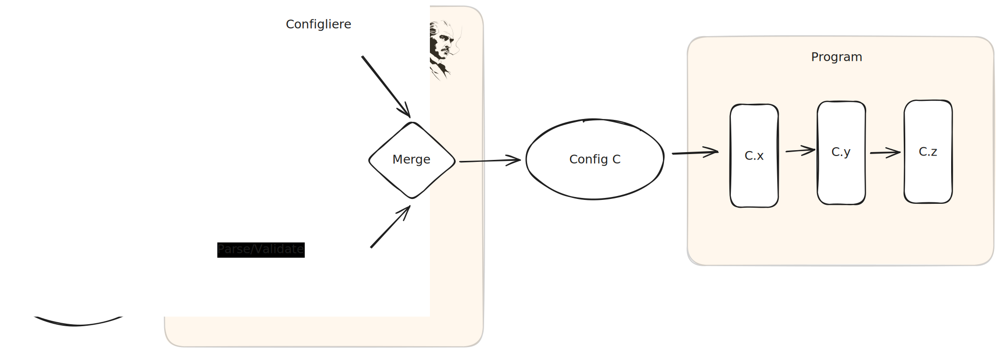

#  Configliere

Smart, FP configuration parser that validates all program inputs ahead of time,
including config files, environment variables, and command line options using a
single schema.

## Introduction

Conceptually, "config" is a palette of settings and switches that is accessed
from various portions of our program to alter its behavior without altering its
code. However the story around config is often made very messy by the fact that
it is read at _different_ times during program execution and from many
_different_ sources such as configuration files and environment variables.


As a result, configuration is often fragile and difficult to understand. Some of
the symptoms of a fragmented config are:

- **The deferred crash** Happens when a program begins running, perhaps even for
  awhile, but then it reaches for a configuration value via an interface like
  `app.getConfig("field")` only to find that the value is invalid, or missing
  altogether. Happens a lot with config files and enviroment variables.
- **conflicting configs** When a program has more than one way of specifying the
  same parameter, and they clobber each other.
  - **Unclear priority** Which parameter wins? The one coming from a CLI option
    or an environment variable?
  - **Mysterious provenance** You can see a value for a github token, but where
    does it come from? It could be from `app-config.yaml`, or
    `app-config.production.yaml`. Then again, it could be specified in the
    `GITHUB_TOKEN` environment variable. But don't forget there is also a
    `--github-token` command line option.
  - **magical behavior** A furiously frustrating deployment-specific failure is
    tracked down to some random environment variable overriding a parameter that
    isn't configured like that in any other enviroment.
- **Ad-hoc validation** - There are different ways to verify the runtime type of
  a configuration value depending on whether it comes from the CLI, environment,
  or a configuration file.

Configliere solves all of these problems by re-imagining "config" not as a
constellation of globally floating objects from which we can read in values at
any point, but instead as a _single_, _pre-validated_, type-safe data structure
that is passed as the input of our program's entry point. It tracks the _source_
of each value that ends up in the final config, so where a parameter is set is
never a mystery.



This has a profound impact on our program as a whole because it lets us treat
the entire process as one function call that takes a single value as its input.

## Quick Start

Configliere uses [Standard Schema][standard-schema] to define the static type of
each configuration parameter as well as to validate that type at runtime. In
these examples, we'll use [Arktype][arktype], but you can use
[any library that implements the Standard Schema spec][schema-libs].

### Simple program

A basic program with options, flags, and positional arguments:

```ts
import { type } from "arktype";
import { cli, field, object, program } from "configliere";

let serve = program({
  name: "serve",
  version: "1.0.0",
  config: object({
    host: {
      description: "hostname to bind",
      aliases: ["-H"],
      ...field(type("string"), field.default("localhost")),
    },
    port: {
      description: "port to listen on",
      aliases: ["-p"],
      ...field(type("number"), field.default(3000)),
    },
    debug: {
      description: "enable debug logging",
      aliases: ["-d"],
      ...field(type("boolean"), field.default(false)),
    },
    entry: {
      description: "entrypoint file",
      ...field(type("string"), cli.argument()),
    },
  }),
});

let parser = serve.createParser({
  args: process.argv.slice(2),
  envs: [{ name: "env", value: process.env }],
});

switch (parser.type) {
  case "help":
    console.log(parser.print());
    break;
  case "version":
    console.log(parser.print());
    break;
  case "main": {
    let parsed = parser.parse();
    if (!parsed.ok) {
      console.error(parsed.error.message);
      process.exit(1);
    }
    let { host, port, debug, entry } = parsed.value;
    // start your server...
  }
}
```

Running `serve --help` prints:

```
Usage: serve [OPTIONS] <entry>

Arguments:
   <entry>                   entrypoint file

Options:
   -H, --host <HOST>         hostname to bind [default: localhost]
   -p, --port <PORT>         port to listen on [default: 3000]
   -d, --debug               enable debug logging [default: false]
   -h, --help                show help
   -v, --version             show version
```

All of these are equivalent:

```sh
serve app.ts -p 8080 --host localhost
HOST=localhost serve app.ts -p 8080
serve app.ts --port=8080 -H localhost
```

### Commands

For programs with subcommands, use `commands()`:

```ts
import { type } from "arktype";
import { cli, commands, field, help, object, program } from "configliere";

let app = program({
  name: "myapp",
  version: "3.2.0",
  config: commands({
    help,
    dev: {
      description: "start dev server",
      ...object({
        port: {
          description: "port to listen on",
          aliases: ["-p"],
          ...field(type("number"), field.default(3000)),
        },
        open: {
          description: "open browser on start",
          ...field(type("boolean"), field.default(false)),
        },
      }),
    },
    build: {
      description: "build for production",
      ...object({
        outdir: {
          description: "output directory",
          aliases: ["-o"],
          ...field(type("string"), field.default("dist")),
        },
      }),
    },
  }),
});
```

Running `myapp -h` prints:

```
Usage: myapp <COMMAND> [OPTIONS]

Commands:
   help                      show help for a command
   dev                       start dev server
   build                     build for production

Options:
   -h, --help                show help
   -v, --version             show version
```

The built-in `help` command provides per-command help. Running `myapp help dev`
prints:

```
Usage: dev [OPTIONS]

Options:
   -p, --port <PORT>         port to listen on [default: 3000]
   --open                    open browser on start [default: false]
```

Parse results are discriminated unions on `name`:

```ts
let parsed = result.parse();
if (parsed.ok) {
  switch (parsed.value.name) {
    case "dev":
      // parsed.value.config is { port: number; open: boolean }
      break;
    case "build":
      // parsed.value.config is { outdir: string }
      break;
    case "help":
      // parsed.value.config is { command: string; text: string }
      console.log(parsed.value.config.text);
      break;
  }
}
```

### Loading config files

Use `sequence()` to split parsing into phases. The first phase reads the config
file path, then you load the file and feed its contents into the second phase:

```ts
import { readFileSync } from "node:fs";
import { type } from "arktype";
import { cli, field, object, program, sequence } from "configliere";

let app = program({
  name: "myctl",
  version: "2.0.0",
  config: sequence(
    object({
      config: {
        description: "config file",
        aliases: ["-c"],
        ...field(type("string")),
      },
    }),
    object({
      port: {
        description: "port to listen on",
        aliases: ["-p"],
        ...field(type("number"), field.default(3000)),
      },
      host: {
        description: "hostname to bind",
        aliases: ["-H"],
        ...field(type("string"), field.default("localhost")),
      },
    }),
  ),
});

let result = app.createParser({
  args: process.argv.slice(2),
  envs: [{ name: "env", value: process.env }],
});

if (result.type === "main") {
  // phase 1: extract the config file path
  let step1 = result.parse();
  if (!step1.ok) {
    console.error(step1.error.message);
    process.exit(1);
  }

  // load the config file
  let config = JSON.parse(readFileSync(step1.value.config, "utf-8"));

  // phase 2: parse remaining args merged with config file values
  let step2 = step1.parse({
    args: step1.remainder.args,
    values: [{ name: step1.value.config, value: config }],
  });
  if (!step2.ok) {
    console.error(step2.error.message);
    process.exit(1);
  }

  let { port, host } = step2.value;
  // start your server...
}
```

Running `myctl -c app.json -p 8080` first extracts `config: "app.json"`, then
loads `app.json` and merges its values with the remaining CLI args. Values from
the CLI take priority over the config file, and all values go through the same
schema validation.

## Configuration Sources

Configliere unifies three input sources. Every value, regardless of source,
passes through the same Standard Schema validation.

### CLI arguments

Options are specified with `--name value` or `--name=value`. Boolean fields are
switches: `--debug` enables, `--no-debug` disables. Positional arguments are
declared with `cli.argument()`. Array fields accept repeated values:
`--user alice --user bob`.

### Environment variables

Field names are automatically mapped to `UPPER_SNAKE_CASE` environment
variables. Nested scopes (e.g. command names) are joined with `_`. For example,
a `port` field inside a `serve` command reads from `SERVE_PORT`.

### Object values

Plain objects can be passed directly (e.g. from a parsed JSON/YAML config file).
Each object value is tagged with a source name for provenance tracking. When
multiple sources provide the same field, CLI args take priority over env vars,
which take priority over object values.

[standard-schema]: https://standardschema.dev
[arktype]: https://arktype.io
[schema-libs]: https://standardschema.dev/#what-schema-libraries-implement-the-spec
